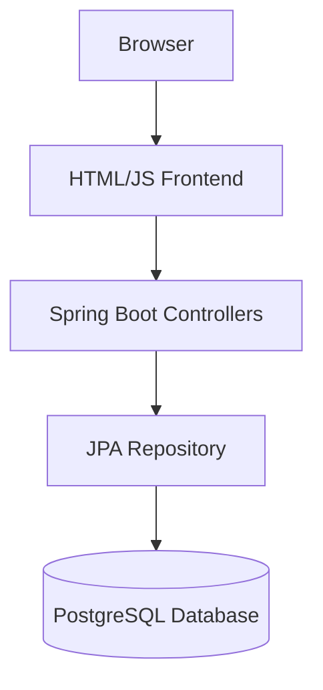

# Location Map Application

This project demonstrates a simple Spring Boot web application for storing geographic locations and visualizing them on an interactive map using OpenStreetMap (completely free!).

## Features

- 🗺️ Interactive map using Leaflet and OpenStreetMap
- 📍 Add locations by clicking on the map or entering coordinates manually
- 💾 PostgreSQL database for data persistence
- 🚀 Spring Boot REST API
- 🐳 Docker containerization for easy deployment

## Requirements

- Docker and Docker Compose
- Maven (for manual build, optional)

## Quick Start

Build and start the containers in detached mode:

```bash
docker compose up --build -d
```

The application will be available at `http://localhost:8080/`.

To view logs:
```bash
docker compose logs -f web
```

To stop the application:
```bash
docker compose down
```

## Environment Variables

- `DB_USER` – database username (`locuser` by default)
- `DB_PASS` – database password (`locpass` by default)

These can be defined in a `.env` file or exported in the shell before running `docker compose`.

## Troubleshooting

- Ensure ports `8080` and `5432` are free.
- If dependencies fail to download, check your internet connection.

## Technical Stack

- **Java 11** - Backend language
- **Spring Boot 2.7.18** - Web framework
- **Spring Data JPA** - Data persistence layer
- **PostgreSQL** - Database
- **Thymeleaf** - Template engine
- **Leaflet** - Interactive map library (using OpenStreetMap)
- **Docker & Docker Compose** - Containerization
- **Maven** - Build tool

## API Endpoints

| Method | Route               | Description                     |
|--------|---------------------|---------------------------------|
| GET    | `/api/locations`   | Get all locations               |
| POST   | `/api/locations`   | Create a new location           |
| GET    | `/`                | Serve the main page             |

## Default Data

A sample location is inserted via `data.sql` when the application starts.

## Project Structure

```
src/
├── main/
│   ├── java/
│   │   └── com/example/demo/
│   │       ├── DemoApplication.java
│   │       ├── controller/
│   │       │   ├── HomeController.java
│   │       │   └── LocationController.java
│   │       ├── entity/
│   │       │   └── Location.java
│   │       └── repository/
│   │           └── LocationRepository.java
│   └── resources/
│       ├── templates/
│       │   └── index.html
│       ├── application.properties
│       └── data.sql
├── Dockerfile
├── docker-compose.yml
└── pom.xml
```

## Manual Build & Run

If you prefer to run without Docker:

1. Make sure you have Java 11 and Maven installed
2. Set up a PostgreSQL database with the credentials in `application.properties`
3. Compile the project:
   ```bash
   mvn clean package
   ```
4. Run the application:
   ```bash
   java -jar target/demo-0.0.1-SNAPSHOT.war
   ```

## Architecture

The application follows a standard Spring Boot architecture:

- **Frontend**: HTML page with JavaScript using Leaflet for map visualization
- **Backend**: Spring Boot with REST controllers
- **Database**: PostgreSQL for persistent storage
- **Communication**: REST API for data exchange



## Contributing

1. Fork the repository
2. Create a feature branch
3. Make your changes
4. Test the changes
5. Create a pull request

## License

This project is open source and available under the [MIT License](LICENSE).
