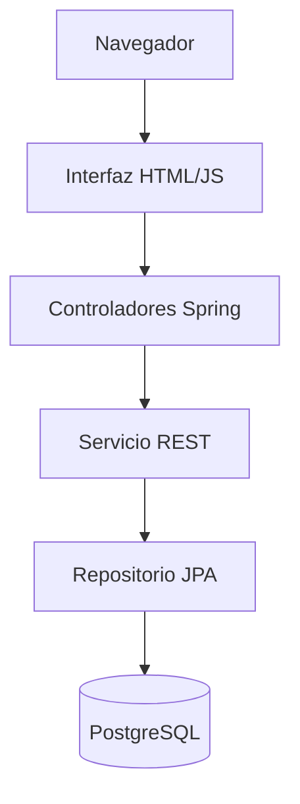
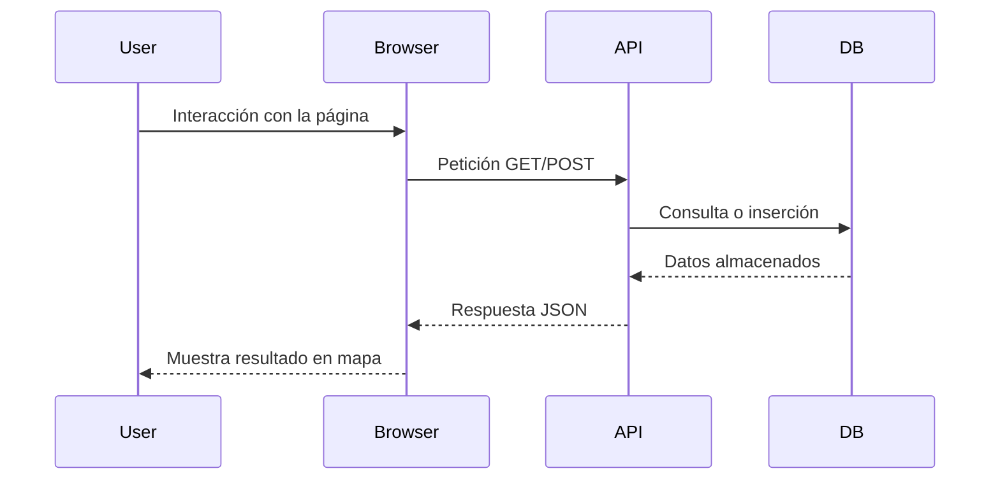
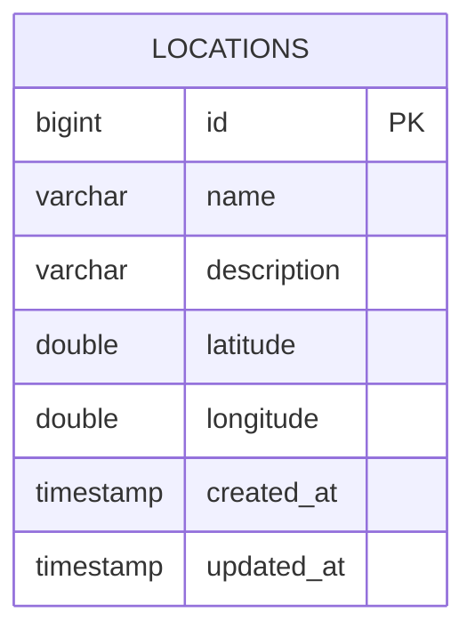
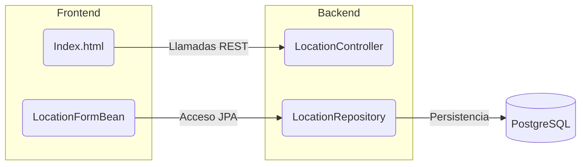

# Documentación Técnica Detallada

## 1. Introducción General del Proyecto

La aplicación **Location Map Application** es un ejemplo sencillo que integra un front-end JSF con un back-end Spring Boot. El objetivo es permitir el registro y visualización de ubicaciones geográficas en un mapa, utilizando PostgreSQL como almacenamiento de datos. A lo largo de este documento se describen en profundidad los módulos, la estructura de archivos y los componentes clave, de modo que cualquier desarrollador pueda comprender, instalar y mantener el proyecto.

### Público objetivo

El proyecto está diseñado para desarrolladores que deseen un ejemplo práctico de integración entre JSF y Spring Boot. Puede ser útil para estudiantes, profesionales que quieran prototipar aplicaciones de geolocalización o como base para sistemas más complejos donde se necesite almacenar y visualizar puntos de interés.

### Resumen de funcionalidades

1. **Visualización de ubicaciones en un mapa**: utilizando la librería Leaflet, la página `index.html` carga todas las ubicaciones almacenadas y las muestra como marcadores interactivos.
2. **Registro de nuevas ubicaciones**: la misma página incluye un formulario que envía los datos al endpoint REST `/api/locations`. Tras guardar la información en la base de datos, la página se actualiza y muestra el nuevo punto en el mapa y en la lista de ubicaciones.
3. **Validación y conversión**: se proveen validadores JSF para las coordenadas y un convertidor para formatear de manera consistente la latitud y longitud. Esto garantiza que solo se almacenen coordenadas válidas y que la interacción con el usuario sea clara y sin errores.

## 2. Descripción técnica del stack

La aplicación se basa en varias tecnologías y herramientas:

- **Java 11**: lenguaje principal del backend.
- **Spring Boot 2.7.18**: marco de trabajo que simplifica la creación de aplicaciones web y proporciona una configuración lista para producción.
- **Hibernate / Spring Data JPA**: para la capa de persistencia, gestionando las entidades JPA y el acceso a la base de datos.
- **PostgreSQL**: base de datos relacional elegida para almacenar las ubicaciones.
- **JSF 2.3**: para la integración de la vista con el backend (aunque la interfaz principal es `index.html`, se incluyen configuraciones JSF para validadores y beans de vista).
- **Thymeleaf**: motor de plantillas que sirve `index.html` desde `src/main/resources/templates`.
- **Docker y Docker Compose**: permiten levantar la aplicación y la base de datos de forma aislada y reproducible.
- **Maven**: herramienta de construcción que gestiona las dependencias y facilita la empaquetación en un archivo WAR.

A nivel de estructura de carpetas, el proyecto sigue un estándar típico de Maven:

```
src/
 └── main/
     ├── java/                 # Código Java de la aplicación
     ├── resources/            # Archivos de configuración y plantillas
     └── webapp/               # Configuraciones JSF
```

En la raíz del proyecto se encuentran archivos esenciales como `pom.xml`, `Dockerfile`, `docker-compose.yml` y el `README.md`. Además, en `docs/` existen dos documentos (ARQUITECTURA.md y CODIGO.md) que describen de forma resumida el sistema y el código.

## 3. Explicación detallada de módulos y clases

### 3.1 `com.example.demo.DemoApplication`

Esta clase contiene el método `main` que arranca la aplicación con `SpringApplication.run`. No incluye lógica adicional, pero es el punto de entrada para ejecutar el proyecto tanto en desarrollo local como dentro del contenedor Docker.

### 3.2 Controladores

- **`HomeController`**: se anota con `@Controller` y define un único `@GetMapping("/")` que devuelve la cadena `"index"`. Esto hace que Spring Busque la plantilla `index.html` dentro de `src/main/resources/templates`.
- **`LocationController`**: es un `@RestController` que maneja la ruta base `/api/locations`. Tiene dos métodos:
  - `List<Location> all()`: asociado a `@GetMapping`, devuelve todas las ubicaciones existentes consultando el repositorio.
  - `Location create(Location location)`: asociado a `@PostMapping`, guarda la ubicación recibida en el cuerpo de la petición.

### 3.3 Entidad `Location`

Mapea la tabla `locations` mediante anotaciones JPA. Incluye campos básicos (id, nombre, descripción, latitud y longitud) y marcas de tiempo `createdAt` y `updatedAt`.

### 3.4 Repositorio `LocationRepository`

Extiende `JpaRepository<Location, Long>` y, al estar anotado con `@Repository`, es detectado automáticamente por Spring. Con esto se heredan métodos CRUD como `findAll`, `save`, `deleteById`, etc., sin necesidad de implementarlos manualmente.

### 3.5 Beans y configuraciones JSF

Bajo el paquete `com.example.demo.jsf` se encuentran componentes específicos para JSF:

- **`LocationFormBean`**: bean de vista (`view scoped`) definido en `faces-config.xml`. Gestiona un objeto `Location` temporal, permite acceder a la lista de ubicaciones y expone el método `save()` que invoca al repositorio para persistir. Tras el guardado, redirige nuevamente a la vista `index.xhtml`.
- **`CoordinateConverter`**: convertidor registrado como `@FacesConverter("coordinateConverter")`. Permite transformar una cadena recibida del formulario a un `Double`, aceptando tanto puntos como comas, y valida que la cadena sea numérica.
- **`LatitudeValidator`** y **`LongitudeValidator`**: ambos implementan `Validator<Double>` y se registran con `@FacesValidator`. Comprueban que las coordenadas estén en los rangos correctos (-90 a 90 para latitud y -180 a 180 para longitud). Si el valor no es válido, lanzan una `ValidatorException` con un mensaje de error.

### 3.6 Configuraciones y recursos

- **`application.properties`**: define la URL de la base de datos, así como el usuario y contraseña. También activa la visualización de las sentencias SQL (`spring.jpa.show-sql=true`) y configura JSF para servir vistas con sufijo `.xhtml`.
- **`data.sql`**: script que se ejecuta al iniciar la aplicación, insertando una ubicación de ejemplo.
- **`faces-config.xml`**: contiene las definiciones de beans, convertidores y validadores JSF, además de reglas de navegación.
- **Archivos de mensajes (`messages.properties`, `messages_en.properties`, `messages_es.properties`)**: almacenan mensajes internacionales para validaciones y respuestas.

### 3.7 Recursos de la interfaz

La plantilla `index.html` (cerca de 368 líneas) contiene estilos CSS, un diseño basado en contenedores, un mapa de Leaflet y una serie de scripts JavaScript que realizan llamadas AJAX al endpoint `/api/locations`. Además, gestiona eventos de clic sobre el mapa para registrar nuevas ubicaciones y actualiza la lista visible de forma dinámica. Aunque la arquitectura soporta JSF, la página es mayormente estática y utiliza Fetch API para comunicarse con el backend.

## 4. Esquema de rutas o endpoints

A nivel de API, el sistema expone los siguientes endpoints:

| Método | Ruta               | Descripción                                       |
|--------|--------------------|---------------------------------------------------|
| GET    | `/api/locations`   | Obtiene la lista completa de ubicaciones.         |
| POST   | `/api/locations`   | Crea una nueva ubicación con los datos enviados.  |
| GET    | `/`                | Devuelve la página principal `index.html`.        |

El formulario de la página llama al endpoint POST y, en caso de éxito, recarga el listado mediante el endpoint GET. No existen más rutas definidas en este ejemplo.

## 5. Diagramas en Markdown

### 5.1 Diagrama de Arquitectura del Sistema



### 5.2 Diagrama de Flujo de Datos



### 5.3 Diagrama Entidad-Relación



### 5.4 Diagrama de Interacción entre Módulos



## 6. Configuración y despliegue

La forma recomendada de desplegar el sistema es mediante Docker Compose. Se definen dos servicios:

1. **db**: utiliza la imagen oficial `postgres:13`. El nombre de la base de datos es `locationdb` y las credenciales se toman de las variables de entorno `DB_USER` y `DB_PASS` (con valores predeterminados `locuser` y `locpass`). Los datos se persisten en el volumen `db_data`.
2. **web**: se construye desde la imagen `openjdk:11-jre-slim`. En la etapa previa, se compila la aplicación con Maven y se genera un archivo WAR que se copia en la imagen final. El contenedor expone el puerto `8080` y arranca con `java -jar /app.war`.

Para levantar ambos servicios, basta ejecutar:

```bash
docker-compose up --build
```

Esto descargará las imágenes necesarias (si no se tienen en caché) y levantará tanto la base de datos como la aplicación web. Tras unos segundos, se podrá acceder a `http://localhost:8080/index.xhtml` en el navegador.

### Configuración local sin Docker

Si se desea probar el proyecto sin contenedores, es necesario tener instalado Java 11, Maven y PostgreSQL. Los pasos serían:

1. Clonar el repositorio.
2. Crear la base de datos `locationdb` y un usuario que coincida con `DB_USER` y `DB_PASS` definidos en `application.properties`.
3. Ejecutar `mvn clean package` para compilar y generar `demo-0.0.1-SNAPSHOT.war`.
4. Ejecutar `java -jar target/demo-0.0.1-SNAPSHOT.war`.
5. Acceder a `http://localhost:8080/` para ver la aplicación.

## 7. Instrucciones técnicas de instalación y ejecución

1. **Instalar dependencias**: asegúrate de contar con Docker y Docker Compose. Opcionalmente, instala Maven si deseas compilar manualmente.
2. **Definir variables de entorno** (opcional):
   - `DB_USER` - nombre de usuario de la base de datos.
   - `DB_PASS` - contraseña del usuario.
   Puedes exportar estas variables o crear un archivo `.env` con el formato `VARIABLE=valor`.
3. **Compilar y levantar**: ejecuta `docker-compose up --build` en la raíz del proyecto. Esto iniciará la base de datos y la aplicación en segundo plano.
4. **Detener los contenedores**: usa `docker-compose down` para apagar y eliminar los contenedores.

## 8. Detalles de pruebas

Este proyecto no incluye pruebas unitarias ni de integración. Para implementarlas en el futuro se recomienda utilizar `Spring Boot Test` junto con herramientas como `JUnit` y `Mockito`. Las pruebas podrían abarcar desde la verificación de los endpoints REST hasta la validación de la capa de repositorio con una base de datos en memoria (por ejemplo H2) durante la ejecución de los tests.

## 9. Buenas prácticas y mantenimiento

- **Modularidad**: el código está organizado en paquetes claros (controladores, entidades, repositorios, JSF). Mantener esta estructura facilita la extensibilidad.
- **Versionado**: se usa Git para el control de versiones. Es recomendable mantener ramas separadas para desarrollo y producción.
- **Dependencias actualizadas**: revisar periódicamente la versión de Spring Boot y de las bibliotecas utilizadas para aplicar correcciones de seguridad y mejoras de rendimiento.
- **Manejo de errores**: implementar manejo de excepciones global (`@ControllerAdvice`) para capturar errores y enviar respuestas coherentes al cliente.
- **Documentación**: actualizar el presente documento conforme se añadan nuevas funcionalidades, rutas o configuraciones.

## 10. Anexos

### Comandos frecuentes

```bash
# Construir y ejecutar con Docker Compose
docker-compose up --build

# Detener y limpiar contenedores
docker-compose down

# Compilar sin pruebas
mvn package -DskipTests

# Ejecutar localmente
java -jar target/demo-0.0.1-SNAPSHOT.war
```

### Decisiones técnicas destacadas

- **Uso de Leaflet** en lugar de Google Maps para simplificar la visualización de los puntos sin depender de una API de pago.
- **Persistencia mediante Spring Data JPA**, reduciendo la cantidad de código necesario para las operaciones de base de datos.
- **Contenedores Docker** para garantizar un entorno reproducible y evitar problemas de configuración en las máquinas de los desarrolladores.

